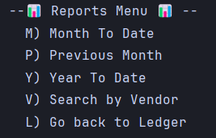

# 💰 CLI Finance Tracker

This command-line application helps users manage personal transactions by saving, viewing, and organizing financial data in a CSV file.

---

## Project Structure

Each class in this project has a clear and focused responsibility:

### `Main.java`
Handles **user interaction** and **menu logic**.
- Customized greeting with name and time of day
- Displays CLI options
- Routes user input to the appropriate service or feature

### `Transaction.java`
Defines the **data model** for a transaction.
- Specifies fields: `date`, `time`, `description`, `vendor`, `amount`
- Groups related data into a single object
- Supports CSV formatting via `toCSV()` method

### `TransactionService.java`
Manages **file handling** for transactions.
- Loads transactions from `transactions.csv`
- Appends new transactions

### `ReportService.java` and `LedgerReports.java`
Provides **filtering and reporting logic**.
- Generates summaries or filtered views (e.g., by vendor or date)

### `Images`

---
